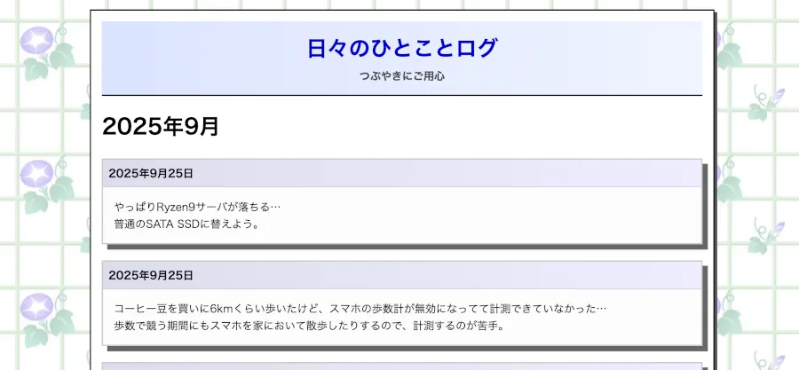

# hugo-web90s-diary

A retro 90s-style diary theme for [Hugo](https://gohugo.io/).  
方眼紙背景に朝顔をあしらった、ノスタルジックな日記風テーマです。



---

## Features

- シンプルでレトロな日記スタイル
- モバイル対応（レスポンシブデザイン）
- カスタマイズしやすいレイアウトとスタイル

---

## Installation

テーマを `themes/` ディレクトリに追加してください。

```bash
git submodule add https://github.com/yourname/web90s-diary.git themes/web90s-diary
```

`hugo.toml` に以下を追記します。

```toml
theme = "hugo-web90s-diary"
```

## Usage

```bash
hugo server -t hugo-web90s-diary
```

`content/` に Markdown ファイルを作成すると日記エントリとして表示されます。

## License

Theme code: MIT License (see [LICENSE](LICENSE))

## Background Image

このテーマはデフォルトで[朝顔の背景](https://www.schoolicons.com/web/backgrnd/mor/mor_ba.html)を利用する想定ですが、画像ファイルは同梱していません。
必要な方は [School Icons CLUB](https://www.schoolicons.com/)より直接ダウンロードしてください。

- 商用・個人利用可、加工可
- 再配布や直リンクは禁止
- 詳細は配布元の 利用規約をご確認ください。
